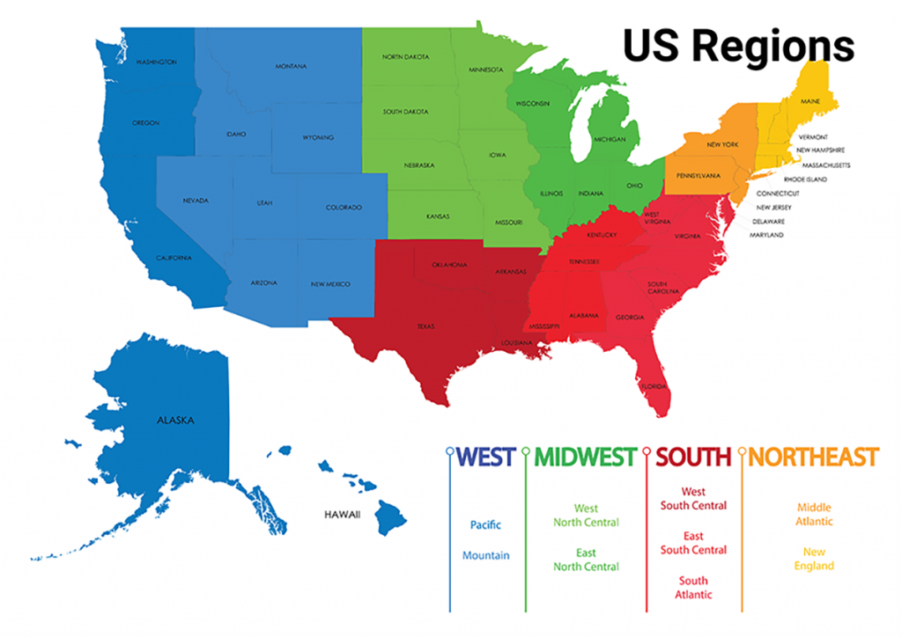

# wgs-sars-cov2
The goal of this project is to identify and visualize variation/divergence (snippet occurence) in SARS-CoV-2 genomes as it concerns the surface glycoprotein (spike protein).

Background

Understanding variation across SARS-CoV-2 genome sequences and particularly spike protein sequences has important implications for the study of virology, vacccination production, and epidemiology. By identifying, visualizing, and interpreting the COVID-19 nucleotide record data, trends in variation can be emphasized, and a phylogenetic analysis can help understand the drift SARS-CoV-2 has taken in the United States. Instead of studying SARS-CoV-2 on the international level, studying SARS-CoV-2 phylogeny and its trends in the United States is useful in viewing the impact of variance on the national level. Through incorporating a precise randomization process during dataset preparation, sample data will be evened out across the states to avoid sampling bias and selection bias. By avoiding any biases when parsing the SARS-CoV-2 genome database, definitively interpreting the data will give significant results on whether there are divergent patterns present within the spike protein sequences across the United States.
COVID-19 continues to spread and evolve since its initial outbreak in 2019. This virus is a +ssRNA virus whose genome contains genetic instructions for the construction of the Spike (S) protein. The S protein is a 1273 amino acid-long glycoprotein that plays a role in SARS-CoV-2 pathogenesis. The S protein is a portion of the SARS-CoV-2 virus that is responsible for receptor recognition and the cell membrane fusion process upon attack. The spike protein is composed of two subunits termed S1 and S2.  The S protein is a 1273 amino acid-long glycoprotein.  Previously published work has shown that changes in biological structure and function of species are attributable to sequence pattern divergence.  The S protein has a high mutational propensity, thus our project goal is to explore whole genome patterns of divergence amongst SARS-CoV-2 strains.  We would like to better understand functional consequences of divergence within the spike protein based on snippet assessments of the protein sequences.
We hypothesize that there are divergent patterns present within the spike protein sequences. Further assessments of these divergence patterns will be critical to our understanding of the levels of significance as pertains to divergence and overall impact to the viral structure and function.

Workflow

Data Preparation
1. Apply a ramdomization process in order to choose random datasets as well as allowing for iterative computing from the NCBI Virus SARS-CoV-2 nucleotide record.
2. Download all of the sequences in a convenient output file format, such as a csv, to upload into GitHub.

Data Analysis

3. Apply a python code but more specifically a snippet occurrence analysis code to interpret the variance among the randomized dataset's sequences (The occurrence of an amino acid mismatch in the S protein sequence and its associated information is called a snippet occurrence).
4. Apply the use of R package, protr package, etc to analyze the data from the snippet occurrence code.

Data Visualization

5. Select 5 different strain sequences based upon snippet occurrences and run PyMol to determine if there would be structural changes. 
6. Create multiple sequence alignments and a phylogenetic tree for data visualization and analysis.

Data Interpretation

7. As the final step, interpreting all of the data that is presented through snippet occurrences or visualization tools is important while concluding results.

Results:

some fundamental questions to ask regarding the data: 

How many genomes are currently available @ NCBI for SARS-CoV-2? 471,705

(Search using this link: https://www.ncbi.nlm.nih.gov/genome/)
How many genomes are from within the USA as of May 18, 2021? 258,988

How many of the usa sequences are complete genomes? (not partial genomes) 140,636

these data were filtered for March 2020-end of April 2020 giving us a total of 1326 (1163 that have the states listed)

- Data from the NCBI website were filtered and categorized  based on US regions in excel: ( North east, Midwest, South, West )
**add pic 

  Because the data used is from the collection date as opposed to the collection date, the number of samples to choose from narrowed down ten-fold. This may not be     as statistically powerful due to the small size, but we decided to use genome sequences that appeared publicly on NCBI to verify that these sequences were processed by NCBI.

- randomization process was done using stratified randomization. 
**add pic 
the code Used is uploaded into the github. 

- Data analysis 

After obtaining all of the randomized accession numbers in a single csv file, the csv was put through the Search Entrez System within the NCBI website. By putting the list of accession numbers in, all of samples’ genomes can be accessed through the NCBI browser. All of the genomic data for all 97 sample records was downloaded into one large FASTA file for further analysis. The FASTA file containing all 97 genomes was uploaded into a program called MEGA or Molecular Evolutionary Genetic Analysis. Through this program, the sequences were put through a multiple sequence alignment tool called Muscle within MEGA. After the multiple sequence alignments were finished, the alignment file was used to make a Maximum Likelihood Phylogenetic Tree through the JTT model with bootstrapping. The tree was constructed using MEGA’s phylogenetic tree construction tool.
**add pic

The same methods were used when analyzing the surface glycoprotein sequences of the randomized accession numbers within our sample dataset. Within the NCBI Virus website, there is a datahub that contains all of the sequence data concerning SARS-CoV-2 where numerous filters can be used to parse out specific data. By adding a filter that utilizes the specific accession numbers from our randomized accession numbers list, the data concerning our randomized sample can be extracted very easily. However, another filter was added, and this filter is a protein specification filter. So, by typing "surface glycoprotein," all of the protein sequences of the 97 samples can be parsed out quickly and efficiently. After adding these two filters, all of the protein sequences for the surface glycoprotein were selected and downloaded as a single large FASTA file. By uploading the large FASTA file into MEGA, a multiple sequence alignment via Muscle was produced, and a Maximum Likelihood Phylogenetic Tree through the JTT model with bootstrapping was constructed in the very same way as the whole genome analysis. Overall in the 97 randomized samples, two multiple sequence alignments and two phylogenetic trees were produced. One alignment and one tree are for the whole genomic analysis for SARS-CoV-2, and one alignment and one tree are for the surface glycoprotein for SARS-CoV-2
**add pic 

**add phylogenetic tree pic 

- Methods used: 

**add pic 

- complications: 

Demographics influence on geographical patterns; how do these impact the phylogenetic tree from the whole genome occurrences

- future direction 

